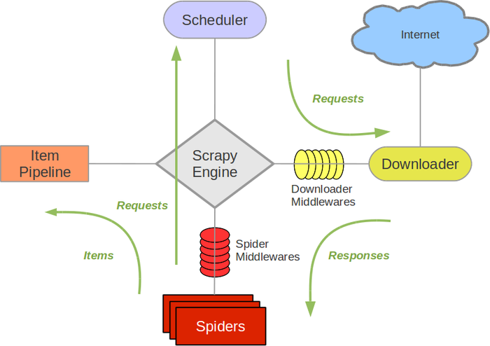
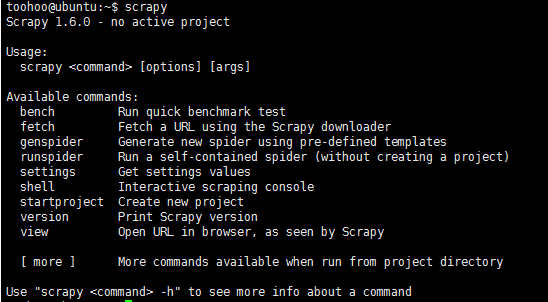

# SpiderInAction

## 基础知识总结

### 1、什么是爬虫
- 爬虫就是模拟浏览器客户端发送网络请求，获取响应，然后按照规则提取数据的程序（照着浏览器发送一模一样的请求和获取和浏览器一模一样的数据）例如百度新闻就是使用爬虫抓取的新闻，然后放上去的，今日头条之前的经营模式也是类似。

### 2、爬虫的数据去哪了？
- 呈现出来：展示在网页上或者展示在App上
- 进行数据分析：从数据库中寻找一些规律，例如百度经验指数。

### 3、需要的软件和环境
- python3
- pycharm
- Chrome浏览器
- 爬虫一些框架Scrapy等

### 4、浏览器的请求
- url(可以在Chrome中的Network中看到)
    - url=请求协议+网站的域名+资源的路径+参数(以？开头，以&进行分割)(其中%...是已经过编码的了，可以在解码工具里面进行解码)
    - 除了一个主要的url之外，还会有很多的链接，都是一些css，js和图片的链接，他们的目的是为了解析显示完整的内容而额外进行的请求。其中Chrome浏览器的Elements选项卡中就是该请求所获得的响应内容。
- 浏览器请求的url地址
    - 当前的url对应的响应+js+css+图片-->Elemrnts中显示的内容
- 爬虫请求的URL地址
    - 只是当前url对应的响应
- Elements的内容和爬虫获取的url的地址响应不同，爬虫中需要以当前的url地址对应的响应为准进行提取数据
- 当前url地址对应的响应在哪里
    - 从Network中找到当前的url地址，点击Response就可以看到
    - 还可以从页面上面右键显示网页的源代码
    - 例如：12306买票，可以使用爬虫将票抢到。

### 5、认识HTTP、HTTPS
- HTTP：超文本传输协议
    - 以明文的形式传输
    - 效率更高，但是不安全
- HTTPS：HTTP+SSL(安全套接字层)
    - 传输数据之前先加密，之后解密获取到数据的内容
    - 传输效率低，但是安全
- HTTP协议请求（典型分析）
    - 请求行：GET(POST) 开头 + /s?(资源链接) + HTTP+版本号
    - 请求头：
        - Keep-alive：常连接
        - Cache-Control：缓存不
        - User-Agent：用户代理，浏览器的ID是什么，明确浏览器是什么类型的：是手机版的还是PC版的，是Chrome还是火狐等等。对方服务器能够通过这个知道当前的请求对方的资源是什么样的浏览器。PC端的Chrome就可以转换成为手机版的。
        - Upgrate-Insecure-Request：请求使用的安全方式：安全还是不安全。
        - Accept：可以接收的内容是什么。
        - Accept-Encoding：zip（压缩），接收的内容的编码方式是什么样的。
        - Accept-language：接收什么语言：例如：zh-CN，en等
        - Cookie：保存用户信息的键值对。在请求的时候带上就可以免登陆（若之前已经登录的话）每次请求会被携带上发送给对方的服务器，这样就能获取登录之后才能访问到的数据和页面。因为对方服务器会通过cookie来判断本地请求是否是爬虫
    - 请求体：
        - get方式没有请求体
        - post方式有请求体
    - Get和Post请求的区别：
        - get请求没有请求体，post有，get请求把数据放到URL地址中
        - post请求常用于登录和注册
        - post请求携带的数据量比get请求大多，常用于传输大文本的时候。
- HTTP协议之响应
    - 1、响应头
        - set cookie：对方的服务器通过该字段，设置cookie到本地，cookie有很多的属性，使用的方式是以键值对的形式来显示的。
        - 响应体：
            - 这里是url地址对应的响应。


## Request模块
### 安装：pip install requests
### 发送get和post请求获取响应
- response = request.get(url) # 发送get请求，请求url地址对应的响应
- response = request.post(url,data={请求体字典},headers=headers)# 发送post请求。

### 实例1：[简单爬取百度首页](/RequestModule/01_Demo1.py)
结论：
- 1、如果不加请求头里面的User-Agent的话，返回的是一个内容很简单的页面，因为百度已经识别出这是一个爬虫。
- 2、如果加上一个请求头的话，返回的内容是完整的一个大的页面，因为百度的服务器以为是一个浏览器在向其请求！


### response的方法，如上面的实例1
- response.text
    - 该方法往往会出现乱码，应该使用response.encoding="utf-8"
- response.content.decode()
    - 把响应的二进制字节流转化成为str类型
- response.request.url # 发送请求的url地址
- response.url        # response相应的url地址
- response.request.headers  # 请求头
- response.headers  # 响应请求

### 获取网页源码的正确打开方式：（从前往后）通过以下三种方式是一定可以获取到网页的正确显示方式的（如实例1和实例2）
- 1、response.content.decode()
- 2、response.content.decode("gbk")
- 3、response.text()

### 发送带有header的请求
headers= {
    "User-Agent":...,
    "Referer":...,
    "Cookie":...
}

### 实例2：[模拟添加请求头：用户代理、cookie等内容请求百度翻译](RequestModule/02_Demo2.py)
结论：
- 1、有一些网站不单只是需要使用用户代理，还需要使用cookie等信息，例如百度翻译，就需要使用到Cookie，而且是使用了js加密算法，将传过去的字符串加密，这样就能起到反爬虫的目的，避免“帮别人翻译”也不知情的尴尬。
- 2、


- 目的：为了模拟浏览器，获取和浏览器一模一样的内容
    - 方法：response = request.get(url,headers=headers)

### 使用超时参数
- request.get(url,headers=headers,timeout=3) # 3秒之内必须返回响应，否则会报错。
- 重试和尝试

### retrying模块的学习
- 安装：pip install retrying
```py
from retrying import retry
@retry(stop_max_attempt_numbers = 3)
def fun1():
    print("this is fun1")
    raise ValueError("this is test error")
```
- [retrying模块实例：使用正确的url和错误的url去爬取百度的首页，正确的很快成功，但是错误的就会失败，失败再次请求，总共请求三次](/RequestModule/retrying_parse.py)

### 处理Cookie的相关请求
- 例如人人网和豆瓣网
    {"email":"123456789@163.com","password":"123"}
- 直接携带cookie请求url地址
    - 1、cookie放在headers中
        - headers = {"User-Agent":...,"Cookie":"..."}
    - [实例3：豆瓣网，直接使用已经登录之后的Cookie请求，这样就可以不用输入账号密码，直接登录](/RequestModule/03_CookieDemo.py)
    - 2、cookie字典传递给cookie的参数。
    - [实例4：豆瓣网，将cookie分割成为键值对，加到字典里面去，请求的时候直接取的cookie字典传过去](/RequestModule/04_Cookie_Dict_Demo.py)
- 先发送post请求，获取到cookie，带上cookie请求登录后的页面
    - 1、session = request.session() #session的作用和request一样
    - 2、session.post(url,data,headers) # 服务器设置本地的cookie会保存在session中
    - 3、session.get(url,headers=headers) # 会带上之前保存在session中的cookie，这样就能请求成功。
    - [实例5：豆瓣网：直接使用session，但是需要单独给出post_data的数据](/RequestModule/05_Cookie_Session_Demo.py)
    - **注意：**
        - 一些网站上面必须要先进行抓包：在Network中勾上Perserve Log对日志进行暴力，避免页面跳转之后包消失。例如新版的豆瓣
        - session其实已经帮我满封装好cookie的处理了，这样就不用过多的进行操心
        - 有一些网站会有反爬虫机制：我们可以使用多套用户名和密码->随机的选取进行尝试->这样对方的服务器会有更加小的几率发现。


## 数据的提取方法
### json 是Python的内建模块-在使用之前直接导入就行
- 数据的交换格式，看起来像Python的类型（列表、字典）的字符串
- json.loads()
    - 把json字符串转化成为Python的类型
    - json.loads(json字符串)
    - [实例6：使用json.loads()将json字符串转化成为Python字典等类型](/RequestModule/06_try_json.py)
- json.dumps()
    - 把python的类型转化成为json字符串
    - json.dumps({"a":"a","b":2}),这个方式可以将python的字典类型的数据转化成为文件保存到本地
    - ensure_ascii=False:让中文能够正常显示为中文
    - indent=2：能够让下一行在上一行的基础上空几个空格（例如两个）显示，让阅读更加人性化
    - [实例7：使用json.dumps()将python类型数据转换成为json字符串](/RequestModule/07_try_json.py)
- **注意：**很多时候我们在url中看到callback=？？？时候都要注意到其是对我们返回json格式的数据是没有任何用处的，完全可以将其删除，又有参数：type=jsonp&Type=jsonp
- 哪里会返回json数据：
    - 我们点击F12对应的小漏斗时候可以过滤对应的URL。在里面找到对应的想要抓取的数据即可
    - 浏览器切换到手机版
    - 抓包app
- [实战：抓取豆瓣电视的json数据,并保存到文件](/RequestModule/08_douban_try_json.py)

### Xpath和lxml
- xpath
    - 一门从HTML中提取数据的语言
- xpath语法（下面的语法可以解决80%的定位）
    - 可以使用xpath helper插件：帮助我们从"Elements"中定位数据
    - 1、选择结点（标签）
        - `/html/head/meta`:能够选中html下的head下的所有的meta标签
    - 2、`//`:能够从任意的结点开始选择
        - `//li`：能够选中当前页面的所有的li标签
        - `/html/head//link`:head下面的所有的link标签，//表示head下的任何一级
    - 3、@符号的用途
        - 定位元素：`//div[@class='feed-infiniter-wrapper']`,@是对div的一种限定也是修饰
        - 获取标签中的属性：如`//a/@href`:选择href的值：
        - 完整的一句：`//div[@class='feed-infiniter-wrapper']/ul/li/div[@class='title-box']/a/@href`
    - 4、获取文本：`/a/text()`
        - 获取a下面的文本
        - 如果是`/a//text()`,就是获取a下面的所有文本。
    - 5、选出div下面的所有的table：`//div[@class="indent"]/div/table`
    - 6、定位元素也可以使用id来进行定位，而且唯一。例如：`//ul[@id="list-content"]`
    - 7、`.`点前：`./a`:当前节点上的a标签

- lxml
    - 安装：pip install lxml
    - 使用：注意，在python3.x以上xlml模块里面已经没有了etree模块，有构造
    ```py
    from lxml import html
    etree = html.etree
    text = ```xxx```  //测试的html文本
    html_ret = etree.HTML(text)
    title = html_ret.xpath("//mata[1]/@content") # 爬虫抓取网页的信息
    print(title)
    ```
    - `.`表示当前的元素
- [实战：使用xpath和lxml两个模块爬取豆瓣电影的网页版页面数据，注意版本的区别，以及lxml的用法](/RequestModule/09_try_lxml.py)


### 爬虫中可能用到的基础知识复习
- format：字符串格式化的一种形式
```py
"爬虫{}有趣".format(1)
"爬虫{}有趣".format([1,2])
"爬虫{}有趣".format([1,2,3])
"爬虫{}有趣{}".format({1,2,3},{1,2,3})
"爬虫{}有趣{}".format({1,2,3},1)
```
- 列表推导式
    - 能够帮助我们生成一堆数据的列表
    - [i+10 for i in range(10)] -->[10,11,12,13,14,15,...,19]
    - ["10月{}日".format(i) for i in range(1,10)] -->
    - ["10月1日","10月2日",...,"10月9日"]
- 字典推导式
    - 帮助我们快速生成一堆数据字典
    - {i+10: i for i in range(10)} # {10:0,11:1,12:2,...,19:9}
    - {"a{}".format(i):10 for i in range(3)} # {"a0":10,"a1":10,"a2":10,}
    
- 三元运算符
    - a = 10 if 4>3 else 20 # a=10
    - a = 10 if 4<3 else 20 # a=20
    - if 后面的条件成立，就把if前面的结果赋值给a，否则把else后面的结果赋值给a。
- [实战：使用requests、xpath和lxml模块抓取糗事百科的段子信息、作者信息等信息，并将信息保存为本地的json格式](/RequestModule/10_qiushiSpider.py)

### 写爬虫的讨论
- 1、url
    - 知道url地址的规律和总的页码数，构造url地址的列表
    - start_url
- 2、发送请求获取响应
    - requests
- 3、提取数据
    - 返回json字符串：json模块
    - 返回的是html字符串；lxml模块会配合xpath提取数据
- 4、保存


## Scrapy框架
- scrapy 是一个纯的python实现的为抓取网站数据的提取结构性数据而编写的应用框架。
- 用户只需要定制开发几个模块就可以轻松实现爬虫，可以是网页爬虫，以及各种图片爬虫，非常方便。
- scrapy使用Twised（主要的对手是tornado）异步网络框架，来处理网络通讯，可以加快我们下载的速度，不需要自己去实现异步框架。


### Scrapy架构图


上图的一些解析：

- Scrapy Engine(引擎)：负责Spider、itemPipeline、Downloader、Scheduler中间的通信、信号、数据的传递等等。
- Schedule(调度器)：负责接收引擎发送过来的Request请求，并按照一定的方式进行整理排序，入队，当引擎需要的时候，交还给引擎。
- Downloader(下载器)：负责下载Scrapy Engine(引擎)发送的所有的Request请求，并将其获得的Responses交还给Scrapy Engine(引擎)，有引擎交给Spider来处理。
- Spider（爬虫）：负责处理所有的Responses，从中分析提取数据，获得Item字段需要的数据，并将需要跟进的URL提交给引擎。
- Item Pipeline（管道）：它负责处理Spider中获取得到的Item，并进行后期处理（详细分析，过滤，存储等）的地方。
- Downloader Middlewares（下载中间件）：你可以当做是一个可以自定义扩展下载功能的组件。
- Spider Middlewares（Spider中间件）：你可以理解是一个可以自定义扩展和操作引擎和Spider中间通信的功能组件（比如进入Spider的Responses；和从Spider出去的Requests）


### Scrapy的运作流程
代码写好了，开始运行程序：
- 1引擎：Hi！Spider，你要处理哪一个网站？
- 2Spider：老大要我处理xxx.com
- 3引擎：你把第一个需要处理的URL给我吧。
- 4Spider：给你，第一个URL是XXXXX.com
- 5引擎：Hi！调度器，我这里有Request请求你帮我排序处理一下。
- 6调度器：好的，正在处理你等一下。
- 7引擎：Hi！调度器，把你处理好的requests请求给我
- 8调度器：给你，这是我处理好的request
- 9引擎：Hi！下载器，你按照老大的下载中间件的设置帮我下载一下这个request请求。
- 10下载器：好的！给你，这是下载好的东西（如果失败，sorry，这个request下载失败了。然后引擎告诉调度器，这个request下载失败了，你记录一下，我们等一下再下载）
- 11引擎：Hi！Spider，这是下载好的东西，并且已将按照老大的下载中间件处理过了，你自己处理一下（注意！这儿responses默认是交给def parse() 这个函数处理的）
- 12Spider：（处理完毕数据之后对于需要跟进的URL），Hi!引擎，我这里有两个结果，这是我需要跟进的url，还有着这个是我获取得到的item数据。
- 13引擎：Hi！管道我这里一个item你帮我处理一下！调度器！这是需要跟进的URL你帮我处理一下，然后从第四步开始循环，直到获取完成老大需要的全部信息。
- 14管道调度器：好的，现在就做！

**注意：** 只有当调度器中不存在任何的request了，整个程序才会停止，（也就是说，对于下载失败的url，Scrapy也会重新下载。）

### 制作Scrapy爬虫一共需要4步：
- 1、新建项目（Scrapy startproject XXX）：新建一个新的爬虫项目
- 2、明确目标（编写items.py）:明确你需要爬取的目标。
- 3、制作爬虫（spiders/xxspider.py）:制作爬虫开始爬取网页。
- 4、存储内容（Pipelines.py）:设计管道存储爬取的内容。

### 安装
Ubuntu的安装方式：
- 直接使用
>`sudo pip install scrapy`
- 不行再使用：
>`sudo apt-get install python-dev python-pip libxml2-dev libxslt1-dev zlib1g-dev libffi-dev libssl-dev`

安装完成之后，在终端输入scrapy，出现提示，代表已经安装成功。



- 上面的一下命令解析：
- bench:性能测试
- fetch：软件抓取文件 scrapy fetch "www.baidu.com"
- genspider:创建爬虫
- runspider：启动爬虫
- setting：设置配置信息
- shell：shell环境
- startproject：创建新的项目
- verson：查看版本号
- view：启动浏览器查看页面
- ...

### 入门案例
#### 学习目标
- 创建一个Scrapy项目
- 定义提取的结构化数据（item）
- 编写爬取网站的Spider并提取出结构化数据（item）
- 编写Item Pipelines来存储提取到的Item（即结构化数据）

#### 一、新建项目（scrapy startproject）

在开始爬取之前，必须创建一个新的Scrapy项目。进入自定义的项目目录中，运行一下命令：

> `scrapy startproject QiuBai`

其中Qiubai是项目名称，可以看到将会创建一个mySpider文件夹。使用tree命令可以查看

这些文件分别是：
- scrapy.cfg:项目的配置文件。
- QiuBai/:项目的Python模块，将会从这里引用代码.
- QiuBai/items.py:项目的目标文件。
- QiuBai/pipelines.py:项目的管道文件。
- QiuBai/settings.py:项目的设置文件。
- QiuBai/spiders/:存储爬虫代码的目录。

#### 二、 明确目标（QiuBai/items.py）
打算抓取糗事百科https://www.qiushibaike.com/   网站里面的所有作者名字，段子内容，好笑数量、评论数和图片路径

- 1、打开 QiuBai 目录下的 items.py 
- 2、Item定义结构化数据字段，用来保存爬取到的数据，有点像Python中的dict，但是提供一些额外的保护减少错误。
- 3、可以通过创建一个scrapy.Item类，并且定义类型为scrapy.Field的类属性来定义一个Item(可以理解成类似于ORM的映射关系)。

接下来创建一个QiubaiItem类，和构建item模型（model）。
```py
import scrapy


class QiubaiItem(scrapy.Item):
    # define the fields for your item here like:
    # 作者名字
    author_name = scrapy.Field()
    # 段子内容
    content = scrapy.Field()
    # 好笑数量
    stats_vote = scrapy.Field()
    # 评论数
    comments = scrapy.Field()
    img = scrapy.Field()
```
### 三、制作爬虫(spiders/QiuBaiSpider.py)
爬虫功能分成三步：

**1、爬数据**

在当前的目录下面输入命令，将在QiuBai/spider目录下面创建一个名为qiubai的爬虫，并指定爬取域的范围：
> `scrapy genspider QiuBaiSpider "qiushibaike.com"`

打开QiuBai/spider目录里面的QiuBaiSpider.py，默认增加下面代码：
```py
import scrapy

class QiubaiSpiderSpider(scrapy.Spider):
    name = "QiubaiSpider"
    allowed_domains = ["qiushibaike.com"]
    start_urls = (
        'http://qiushibaike.com/',
    )

    def parse(self, response):
        pass
```
其实也可以有我们自己创建QiuBaiSpider.py并编写上面的代码，只不过是使用命令可以免去编写固定代码的麻烦。
要建立一个Spider，必须使用scrapy.Spider类创建一个子类，并确定了三个强制的属性和一个方法。
name="":这个是爬虫的识别名称，必须是唯一的，在不同的爬虫必须定义不同的名字。
allow_domains = []是搜索的域名范围，也就是爬虫的约束区域，规定爬虫只能爬取这个域名下面的网页，不存在的URL会被忽略。
start_urls = ():爬取的URL元组/列表。爬虫从这里开始抓取数据，所以，第一次下载的数据将会从这些urls开始。其他的子URL将会从这些其实的URL中继承性生成。
parse(self,response):解析的方法，每个初始的URL完成下载后将被调用，调用的时候传入从每个URL传回的Response对象来作为唯一的参数，主要的作用如下：
负责解析返回的网页数据（response.body）,提取结构化数据(生成item)
生成需要下一页的URL请求。
将start_urls的值修改为需要爬取的第一个url
>`start_urls = ("https://www.qiushibaike.com/hot/page/1/",)`

修改parse()方法
```py
def pase(self,response):
    filename = "qiubai.html"
    open(file,'w').write(response.body)
```
然后运行一下看看，在QiuBai目录下面运行：
> `scrapy crawl QiuBaiSpider`

上面的QiuBaiSpider就是QiubaispiderSpider类的name属性，也就是使用scrapy genspider命令的唯一爬虫名字。
运行之后，如果打印的日志出现 [scrapy] INFO: Spider closed (finished)，代表执行完成。 之后当前文件夹中就出现了一个 qiubai.html 文件，里面就是我们刚刚要爬取的网页的全部源代码信息。

**注意：** Python2.x默认编码环境是ASCII，当和取回的数据编码格式不一致时，可能会造成乱码；我们可以指定保存内容的编码格式，一般情况下，我们可以在代码最上方添加
```py
import sys
reload(sys)
sys.setdefaultencoding("utf-8")
```
这三行代码是 Python2.x 里解决中文编码的万能钥匙，经过这么多年的吐槽后 Python3 学乖了，默认编码是Unicode了...(祝大家早日拥抱Python3)

**2、取数据：**

根据前面介绍到的xpath语法，我们可以使用它来对页面数据进行获取。
并将之前定义的QiuBai/items.py中的QiubaiItem类引入
>`from  QiuBai.items import QiubaiItem`

修改QiuBaiSpider.py文件中的代码如下：
```py
# -*- coding: utf-8 -*-
import scrapy
from  QiuBai.items import QiubaiItem

class QiubaispiderSpider(scrapy.Spider):
    # 爬虫的名称，启动爬虫时需要的参数（必需）
    name = 'QiuBaiSpider'
    # 爬取域范围，允许爬虫在这个域名下进行爬取（可选）
    allowed_domains = ['www.qiushibaike.com']
    # 起始url列表，爬虫执行后的第一批请求，将从这个列表中获取
    start_urls = ['https://www.qiushibaike.com/hot/page/{}/'.format(i) for i in range(1, 14)]

    def parse(self, response):
        # 1、获取到所有的段子的列表
        div_list = response.xpath("//div[@id='content']//div[@id='content-left']/div")
        # content_list = []
        # 2、分组处理：
        for content in div_list:
            # 这里需要用上导入的QiubaiItem
            # 记得需要加上extract()，返回一个list,否则报错：TypeError: <Selector xpath= ... is not JSON serializable
            # TypeError: <Selector xpath=".//div[@class='author clearfix']/a/h2/text()" data=u'\n\u996e\u6700\u70c8\u7684\u9152\u3001\u8279\u6700\u7231\u2026\n'> is not JSON serializable
            item = QiubaiItem()
            item["author_name"] = content.xpath(".//div[@class='author clearfix']/a/h2/text()").extract()
            item["author_name"] = item["author_name"][0].strip() if len(item["author_name"]) > 0 else None
            item["content"] = content.xpath(".//div[@class='content']/span/text()").extract()
            item["content"] = item["content"][0].strip() if len(item["content"]) > 0 else None
            item["stats_vote"] = content.xpath(".//div[@class='stats']/span[@class='stats-vote']/i/text()").extract()
            item["stats_vote"] = item["stats_vote"][0] if len(item["stats_vote"]) > 0 else None
            item["comments"] = content.xpath(".//a[@class='qiushi_comments']/i/text()").extract()
            item["comments"] = item["comments"][0] if len(item["comments"]) > 0 else None
            item["img"] = content.xpath(".//div[@class='thumb']/a/img/@src").extract()
            item["img"] = "https:" + item["img"][0] if len(item["img"]) > 0 else None
            # 返回提取到的每一个item数据，给管道文件进行处理，同时还会返回回来继续执行后面的代码
            yield item
```
**注意：**
这里使用yield关键字的作用是：使得处理完成一个item之后，管道那边再次返回，这样就不会以习性处理，避免在成内存不够用。处理完成一个item之后，继续回到当前位置执行新的item，爬取新的内容。如果使用return的话，只会返回结果，不会再回来了。这样程序就终端了。
同样道理，管道那边也必须返回item，否则程序也会中断的。

**3、处理管道，保存数据Item Pipeline**

当item在Spider中被收集之后，它将会被传送到Item Pipline，这些Item Pipline组件按照定义的顺序处理Item。
每个ItemPiPline都是实现了简单方法的Python类，比如决定此Item是丢弃还是存储。一下是item 

Pipline的一些典型的应用：

- 验证爬取的数据(检查item包含的某些字段，比如说name字段)
- 查重（使用set去重并丢弃）
- 将爬取的结果保存到文件或者数据库中。

- 编写 Item Pipeline非常简单，item pipline组件是一个独立的Python类，其中的process_item()方法是必须实现的。
- **将item写入到JSON文件**
- 以下的Pipeline将所有的从spider中爬取到的item，存储到一个独立的items.json文件，每行包含一个序列化'JSON'格式的'item'。

打开QiuBai/pipelines.py,编写管道处理文件如下所示：
```py
# -*- coding: utf-8 -*-

# Define your item pipelines here
#
# Don't forget to add your pipeline to the ITEM_PIPELINES setting
# See: https://doc.scrapy.org/en/latest/topics/item-pipeline.html

import json

class QiubaiPipeline(object):
    def __init__(self):
        # 初始化一次之后就不再执行，将数据写到文件里面去（可选）
        #一个item过来
        self.f = open("qiubai_pipeline.json", "w")

        # 这个方法是默认生产的，管道就是由来出来传过来的item的，一模一样，名字不一样也是它
    def process_item(self, item, spider):
        # 将python的字典转换成为字符串存储到本地,因为传入的item不是真正字典所以需要强转一下
        content = json.dumps(dict(item),ensure_ascii = False) + ",\n"
        # 写入到json文件里面去
        self.f.write(content.encode("utf-8"))
        # 如果有多个管道就交给下一个管道，最后没有管道才交给引擎
        # 一定要返回到引擎，告诉引擎我处理完了，给我下一个item吧
        return item

    def close_spider(self,spider):
        # 最后关闭打开的文件（打开文件之后要关闭）
        self.f.close()
```

**启用一个Item Pipeline组件**

为了启用Item Pipeline组件，必须将它的类添加到settings.py文件的ITEM_PIPELINE配置，
需要修改setting.py文件里面的一些参数

- 1、将Robot协议设置成为False或者注释掉
>`ROBOTSTXT_OBEY = False`

- 2、打开管道:将管道配置前面的注释去掉。

```py
ITEM_PIPELINES = {
   'QiuBai.pipelines.QiubaiPipeline': 300,
}
```

- 注意 :分配给每个类的整型值，确定了他们的运行的顺序，item按照数字从低到高的顺序，通过pipeline，通常将这些数字定义在0-1000的范围之内数值越低，组件的优先级就越高。

- 3、设置默认的请求头：
```py
DEFAULT_REQUEST_HEADERS = {
   'Accept': 'text/html,application/xhtml+xml,application/xml;q=0.9,*/*;q=0.8',
   'Accept-Language': 'en',
   'User-Agent': 'Mozilla/5.0 (Windows NT 10.0; Win64; x64) AppleWebKit/537.36 (KHTML, like Gecko) Chrome/71.0.3578.98 Safari/537.36'
}
```
**4、运行爬虫**

代码编写好之后，启动程序运行

- 1、先检查一下爬虫编写的大问题有没有：
>`scrapy check QiuBaiSpider`

- 2、没有问题就可以运行程序了：
>`scrapy crawl QiuBaiSpider`

这样就可以查看当前的目录是否生成`qiubai_pipeline.json`文件了。


## 启动Scrapy Shell
进入项目的根目录，执行下列命令来启动shell

>$ scrapy shell "https://www.qiushibaike.com/hot/page/1/"

Scrapy Shell 根据下载的页面会自动创建一些方便使用的对象，例如Response对象，以及Selector对象（对应HTML和XML内容）。

- 当Shell载入之后，将会得到一个包含response数据的本地response变量，输入response.body将会输出response的包体，输入response.headers 可以看到response的包头。
- 输入response.selector时候，将会获取到一个response初始化的类Selector的对象，此时可以通过使用response.selector.xpath()或者response.selector.css()来对response进行查询。
- Scrapy也提供了一些快捷方式，例如response.xpath()或者response.css()同样可以生效(例如之前的案例)。

## Selectors选择器
`Scrapy Selector`内置的`Xpath`和`CSS Selector`表达式机制

Selector有四个基本的方法，最常用的是xpath

- xpath():传入的xpath表达式，返回该表达式所对应的所有结点的selector list列表
- extract():序列化该节点为Unicode字符串并返回list
    - 注意：在Scrapy框架里面调用xpath选择结点之后，需要使用extract()返回Unicode字符串列表！否则会报错，转化不成json！
- css()传入CSS表达式，返回该表达式的所对应的所有结点的selector list列表，语法同BeautifulSoup4
- re()根据传入的正则表达式对数据进行提取，返回Unicode字符串list列表。

### 具体的Xpath表达式的例子及对应的涵义可以参考上面的xpath语法


## Scrapy框架项目实战：

### 项目一：
[使用Scrapy框架爬取糗事百科的段子和作者姓名等内容-页面元素爬取](/Scrapy/QiuBai)
### 项目二：
[使用Scrapy框架爬取招聘网站--赶集网的职位等信息-页面元素爬取](/Scrapy/Ganji)
### 项目三：
[使用Scrapy框架爬取腾讯招聘网站的职位和工作信息-json格式数据爬取](/Scrapy/Tencent)
### 项目四：
[使用Scrapy框架爬取斗鱼的主播高清大图并将图片名另存为主播昵称-手机json格式数据爬取](/Scrapy/Douyu)


